.. Maptools documentation master file, created by
   sphinx-quickstart on Fri Jul  7 23:12:31 2023.
   You can adapt this file completely to your liking, but it should at least
   contain the root `toctree` directive.

Welcome to |name|'s documentation!
======================================

什么是 |name|?
------------------

|name| (Memristor-based-AI Production Tools) 是一套基于 Python 的忆阻器 (Memristor) 存算一体AI芯片设计开发辅助工具包, 能够实现从算法到硬件层面的端到端映射以及系统预仿真. 

.. raw:: html

     

|name| 分为映射工具链和仿真工具集两部分, 如上图所示, 映射工具链链用于实现 AI 模型的端到端映射, 仿真工具集接收来自映射工具链产生的硬件配置信息,  实现对所述模型在存算一体架构中执行过程的仿真,  从而实现对系统指标的评估. 其中:

+ 映射工具链由量化器 (Quantizer),  onnx 转换器 (OnnxConverter),  Tile映射器 (TileMapper) 和NoC映射器 (NocMapper) 组成; 

+ 仿真工具集由准确率仿真器 (CalcuSim) 和缓冲容量评估器 (TokSim) 组成. 

存算一体AI芯片架构
--------------------

.. raw:: html

     

存算一体AI芯片内部是一个以存算一体阵列, 存算一体阵列由多个 Tile 排列构成, 多个 Tile 之间通过 Mesh 拓扑的片上网络 (Network on Chip,  NoC) 实现互连和通信.  

其中, 每个 Tile 包含一个 Xbar (Crossbar, 专指忆阻器计算阵列) 和一套对应的 ADC,  此外, 每个 Tile 内还设有必要的数字模块以实现对存算一体计算模式的补充, 每个 Tile 能够执行一个连续的“卷积→Bias→Add→激活→池化或上采样”操作. 在进行模型映射时, 将目标神经网络根据 Tile 的计算模式切分成多个 Tile 任务并部署至每个 Tile, 多个 Tile 间实现并行运算, 并通过片上网络实现彼此之间的通信.  

片上网络是一个由路由器 (Router), 链路 (Link) 和网络接口 (Network Interface,  NI) 组成的硬件结构, 其中:

+ 链路是数据传输的物理载体;
+ 路由器是实现数据交换和路由的功能核心;
+ 网络接口是路由器与Tile通信的接口.

每个路由器挂载一个 Tile, 并提供对应的网络接口实现路由器和Tile 之间的数据传输, 网络接口中设置有 cast,  merge 和 gather 三个独立的接口, 分别用于承载不同类型的消息数据. 每个路由器基于路由表实现数据路由, 并通过为每个端口提供多个虚通道 (Virtual Channel,  VC) 实现不同类型消息之间的隔离, 多个输入端口传入的数据通过虚通道仲裁器 (VC Allocator,  VA) 和链路仲裁器 (Switch Allocator,  SA)  实现调度, 并从期望的输出端口传出. 

.. note::

   在之后的版本中, 为了节约硬件开销, 可能会将cast和gather接口合并, 统称cast接口.

.. important::

   在存算一体AI芯片工作的过程中, 所有 Tile 能够并行工作, 形成一个 Tile 间流水线; 而在每个 Tile 内部, 数据在 Tile 配置指令的指导下以向量的形式实现计算,  因此每个 Tile 可以看做一个 SIMD 单元. 我们将这种存算一体计算范式称为 “存算一体 SIMD 流计算”. 

.. toctree::
   :hidden:
   :caption: Maptools 安装与配置
   :maxdepth: 1

   Maptools安装与配置/安装环境介绍.rst
   Maptools安装与配置/安装依赖库.rst
   Maptools安装与配置/安装Maptools.rst
   Maptools安装与配置/配置环境变量.rst

.. toctree::
   :hidden:
   :caption: 使用 Maptools 执行模型映射
   :maxdepth: 1

   使用Maptools执行模型映射/准备你的AI模型.rst
   使用Maptools执行模型映射/配置全局参数.rst
   使用Maptools执行模型映射/执行模型量化.rst
   使用Maptools执行模型映射/执行模型转换.rst
   使用Maptools执行模型映射/执行Tile映射 (逻辑映射).rst
   使用Maptools执行模型映射/执行NoC映射 (物理映射).rst

.. toctree::
   :hidden:
   :caption: 使用 Maptools 执行系统仿真
   :maxdepth: 1

   使用Maptools执行系统仿真/映射前仿真.rst
   使用Maptools执行系统仿真/CalcuSim仿真.rst
   使用Maptools执行系统仿真/TokSim仿真.rst

.. toctree::
   :hidden:
   :caption: Maptools 源代码结构
   :maxdepth: 1

   Maptools源代码结构/core.rst
   Maptools源代码结构/quantization.rst
   Maptools源代码结构/mapper.rst
   Maptools源代码结构/nlrt.rst
   Maptools源代码结构/calcusim.rst
   Maptools源代码结构/toksim.rst
   Maptools源代码结构/drawing.rst

   

