CalcuSim仿真
=============

什么是 :py:data:`CalcuSim` 仿真?
----------------------------------

:py:data:`CalcuSim` 是一款面向存算一体AI芯片的准确率仿真工具.
它根据 :py:data:`CTG` 中每个 Tile 的配置信息构建出存算一体中的硬件计算模型, 能够实现对硬件中每个 Tile 计算过程的模拟以及中间计算结果的观测, 从而实现对实际存算一体AI芯片识别准确率的精确评估. 另外, 用户可以调节 :py:data:`CalcuSim` 的硬件参数, 以实现不同硬件配置模式下的准确率评估.

.. important::

    :py:data:`CalcuSim` 针对 Tile 内部硬件的实际计算特性 (如逐 bit 输入 (Bit Serial),  ADC 箝位 (Clamp) 等, 量化转换, 乘法解构等)  进行了软件模拟, 
    并为用户注入器件非理想因素 (比如 IVC 系数 (电流-电压转换系数),  ADC 量化误差以及 Xbar 权重漂移等) 提供了可扩展接口, 从而能够实现对整个硬件计算过程的精确模拟. 

:py:data:`CalcuSim` 的组织结构
-------------------------------

:py:data:`CalcuSim` 由 :py:data:`DeviceTask` (设备任务执行器) 和 :py:data:`HostTask` (主机任务执行器) 两部分组成, 
其中 :py:data:`DeviceTask` 是主体, :py:data:`DeviceTask` 包含多个 :py:data:`TileTask`, 每个 :py:data:`TileTask` 内部实现了对Tile 计算过程的模拟,
如下图所示:

.. raw:: html

     

:py:data:`ModelTask` 本质是一个 :py:data:`torch.nn.Module`, 支持 `cuda` 加速, 用户可以像调用 :py:data:`torch.nn.Module` 模型那样通过调用 :py:data:`CalcuSim.forward` 方法实现 :py:data:`CalcuSim` 仿真, 并通过调用 :py:data:`CalcuSim.cuda` 方法实现 `cuda` 加速.

单张图片的 :py:data:`CalcuSim` 仿真
------------------------------------

:py:data:`CalcuSim` 支持量化前仿真和量化后仿真, 用户可以通过在构建 :py:data:`CalcuSim` 对象时设置对应 :py:data:`quantize` 参数, 以决定是否开启量化后仿真.

.. attention::

    :py:data:`CalcuSim` 是用来模拟硬件计算的, 那 :py:data:`CalcuSim` 的量化前仿真有何意义?

    :py:data:`CalcuSim` 的量化前仿真可以用于验证Tile映射的正确性, 因为当Tile映射出现错误时, 所构建出的 :py:data:`CTG` 是不正确的, 因此 :py:data:`CalcuSim` 的仿真结果自然也是错误的.

在构建 :py:data:`CalcuSim` 时, 需要传入三个位置参数:

+ :py:data:`CTG`, 可以从 :py:data:`TileMapper.ctg` 属性获取.
+ :py:data:`HostGraph` 类型的主机算子图, 可以从 :py:data:`OnnxConverter.host_graph` 属性获取.
+ :py:data:`ModelParams` 类型的模型参数, 在执行量化前仿真时, 该模型参数可以从 :py:data:`OnnxConverter.params` 属性获取, 在执行量化后仿真时, 需要使用 |name| 提供的 :py:data:`read_quantparams` 从量化保存的 `./mapsave/your-mapname/quantparams.pkl` 中读取量化后的模型参数. 

另外, :py:data:`CalcuSim` 还接受一些关键字参数, 详见 :py:data:`CalcuSim.__init__`.

量化前仿真
~~~~~~~~~~~

下面展示了一个使用 :py:data:`CalcuSim` 进行单张图片量化前仿真的示例:

.. code-block:: python

    # 代码接上回
    ...

    # 创建CalcuSim仿真器, tm是TileMapper, oc是OnnxConverter
    csim = CalcuSim(tm.ctg, oc.host_graph, oc.params, quantize=False)

    # 获取输入图片数据, 缩放至 224 × 224
    input = get_input('path/to/your/image.png', resize=(224, 224))

    # 运行CalcuSim仿真, 获得输出结果
    output = csim(input)

    # 仿真结果验证
    ...

量化后仿真
~~~~~~~~~~~

在确定量化前仿真结果无误后, 便可将关键字参数 :py:data:`quantize` 设置为 `True` 以执行量化后仿真. 但是需要注意, 为了模拟实际的Xbar的卷积运算过程, 还需要将关键字参数 :py:data:`physical` 设置为 `True`, 这一点是非常重要的.

MAC结果范围统计
+++++++++++++++

.. note::

    当 :py:data:`physical` 设置为 `False` 时, :py:data:`CalcuSim` 使用Pytorch提供的 :py:data:`torch.nn.functional.conv2d` 函数实现卷积计算, 但当 :py:data:`physical` 设置为 `True` 时, :py:data:`CalcuSim` 使用自定义的 :py:data:`cimu_conv2d` 函数模拟Xbar的卷积运算过程, 包括ADC的箝位.
    
    ADC箝位意味着在执行量化后仿真时, 不管Xbar的BL (Bitline) 上的MAC (乘累加) 结果的值是多大, 都会将其截断至ADC的量程内, 如果MAC结果比较大, 意味着绝大部分信息都会因为ADC的箝位而丢失, 因此会带来致命性的影响. 合理调整IVC系数可以减少ADC箝位带来的信息损失, IVC系数的效果相当于在将MAC结果乘以一个收缩系数后再输入至ADC, 因此能够尽可能地将MAC结果收缩到ADC的量程内.

    ICV系数 (IVCF) 应当设置为多大取决于每个BL上的MAC结果的范围, 如果范围很大, 则IVCF需要设置得比较小.

问题在于, 在执行量化后仿真之前, 并不知道MAC结果的范围是多少, 为此 :py:data:`CalcuSim` 提供了MAC结果范围统计的功能, 用户只需要在创建 :py:data:`CalcuSim` 对象时设置关键字参数 :py:data:`stats` 为 `True`, 之后运行仿真时会自动禁用ADC箝位并进行MAC结果范围统计, 如下:

.. code-block:: python

    # 代码接上回
    ...

    # 获取量化后的模型参数
    params = read_quantparams(config['mapname'])

    # 创建CalcuSim仿真器, tm是TileMapper, oc是OnnxConverter, 启动MAC结果范围统计
    csim = CalcuSim(
        tm.ctg, oc.host_graph, params, 
        quantize=True, physical=True, stats=True
    )

    # 获取输入图片数据, 缩放至 224 × 224
    input = get_input('path/to/your/image.png', resize=(224, 224))

    # 运行CalcuSim仿真, 获得输出结果
    output = csim(input)

运行结束后, 会在终端自动打印出MAC结果范围统计报告, 如下:

.. code-block:: shell

    --> Tile (15, 0, 0, 0)
    bit(0 for LSB):0    range:  (-3377, 1838)   avg_abs: 639.116
    bit(0 for LSB):1    range:  (-2972, 1917)   avg_abs: 605.306
    bit(0 for LSB):2    range:  (-3229, 2113)   avg_abs: 636.341
    bit(0 for LSB):3    range:  (-3206, 2102)   avg_abs: 611.838
    bit(0 for LSB):4    range:  (-2951, 2293)   avg_abs: 473.107
    bit(0 for LSB):5    range:  (-1360, 1182)   avg_abs: 119.271
    bit(0 for LSB):6    range:  (-609, 737)     avg_abs: 15.876
    bit(0 for LSB):7    range:  (0, 0)          avg_abs: 0.0

根据统计结果设置IVC系数
+++++++++++++++++++++++

根据MAC结果范围设置合理的IVCF, 比如对于上述报告, 根据经验IVCF可以设置为 2500/128-3500/128 (默认ADC是8bit, 考虑正负).

.. attention::

    目前为了便于配置, 所有Tile的所有BL都共用同一个IVCF, 之后的版本中会考虑实现逐Tile或逐BL的IVCF细粒度配置.

执行仿真
+++++++++

设置好了IVCF系数, 就可以正式开始量化后仿真了, 与量化前仿真类似, 如下:

.. code-block:: python

    # 代码接上回
    ...

    # 获取量化后的模型参数
    params = read_quantparams(config['mapname'])

    # 创建CalcuSim仿真器, tm是TileMapper, oc是OnnxConverter
    csim = CalcuSim(
        tm.ctg, oc.host_graph, params, 
        quantize=True, physical=True
    )

    # 获取输入图片数据, 缩放至 224 × 224
    input = get_input('path/to/your/image.png', resize=(224, 224))

    # 运行CalcuSim仿真, 获得输出结果
    output = csim(input)

    # 仿真结果验证
    ...

中间结果观测
-------------

中间结果保存
~~~~~~~~~~~~~~~

为了观测每个Tile的中间结果, 可以在创建 :py:data:`CalcuSim` 时设置关键字参数 :py:data:`observe` 为 `True`. 之后运行仿真, 并调用 :py:data:`CalcuSim.save_results` 方法, 中间结果会被保存至 `./mapsave/your-mapname/calcusim` 目录中, 如下:

.. code-block:: python

    # 代码接上回
    ...

    # 获取量化后的模型参数
    params = read_quantparams(config['mapname'])

    # 创建CalcuSim仿真器, tm是TileMapper, oc是OnnxConverter
    csim = CalcuSim(
        tm.ctg, oc.host_graph, params, 
        quantize=True, physical=True, observe=True
    )

    # 获取输入图片数据, 缩放至 224 × 224
    input = get_input('path/to/your/image.png', resize=(224, 224))

    # 运行CalcuSim仿真, 获得输出结果
    output = csim(input)

    # 保存中间结果
    csim.save_results('your-filename')

中间结果读取
~~~~~~~~~~~~

可以使用 |name| 提供的 :py:data:`read_results` 函数读取保存的中间结果文件, 得到的是一个字典, 其 `key` 是 :py:data:`LogicalTile` 格式的逻辑Tile, `value` 是该Tile的中间结果字典, 建议用户自行查看该字典的结构并获取目标中间结果, 如下:

.. code-block:: python

    from maptools import read_results

    # 读取保存的中间结果
    res = read_results('your-mapname', 'your-filename')

    # 查看中间结果字典的结构
    print(type(res))
    print(res.keys())
    print(type(res[(0,0,0,0)]))
    print(res[(0,0,0,0)].keys())

    # 打印出 (0,0,0,0) 这个逻辑Tile的cast输入数据
    print(res[(0,0,0,0)]['cast_in'])

使用测试集实现准确率评估
-------------------------

单张的图片推理只能测试存算一体AI芯片在单一数据上的计算精确度, 而为了获得存算一体AI芯片的识别准确率, 需要使用测试数据集进行测试统计.

下面以一个示例展示了如何使用 :py:data:`CalcuSim` 统计 `ResNet18` 模型在 `ImageNet` 测试集上的准确率:

.. code-block:: python

    import torch
    import onnx
    import torchvision as tv
    import torchvision.transforms as transforms
    from torchvision.models import resnet18, resnet50
    from torch.utils.data import DataLoader
    from typing import List, Tuple, Dict
    from maptools import *

    K = 3 # 准确率指标为 K-ACC
    MAPNAME = 'resnet18' 
    ONNXDIR = 'onnx_models/simp-resnet18.onnx'
    QUANTIZE = True # 是否进行量化
    DEVICE = 'cpu' # 是否使用CUDA加速
    BATCHSIZE = 32 # Batch 大小
    PHYSICAL = True # 是否模拟真实的Xbar和ADC计算
    HARDTRANS = True # 是否模拟真实的定点数乘法
    IVCF = 4000/128 # ADC电流-电压转换系数

    ########################## 以下是 CalcuSim 模型 ########################################
    model = onnx.load(ONNXDIR)
    oc = OnnxConverter(model, mapname=MAPNAME, quantize=QUANTIZE)
    oc.run_conversion()

    xm = TileMapper(
        oc.device_graph, 
        256, 
        256*5, 
        mapname=MAPNAME,
        quantize=QUANTIZE
    )

    xm.run_map()
    params = read_quantparams(MAPNAME) if QUANTIZE else oc.params
    model = CalcuSim(
        xm.ctg, 
        oc.host_graph, 
        params, 
        mapname=MAPNAME, 
        quantize=QUANTIZE, 
        physical=PHYSICAL, 
        hardtrans=HARDTRANS,
        ivcf=IVCF
    )
    ########################## 以上是 CalcuSim 模型 ########################################

    ########################## 以下是 Pytorch 对照模型 ######################################
    # model = resnet18(pretrained=True)
    # model.eval()
    ########################## 以上是 Pytorch 对照模型 ######################################

    ########################## 以下是 测试集构建 ############################################
    device = torch.device(DEVICE)
    if DEVICE == 'cuda':
        model.cuda()

    trans = transforms.Compose([
        transforms.Resize([224, 224]),
        transforms.ToTensor(),
        transforms.Normalize(mean=(0.485, 0.456, 0.406), std=(0.229, 0.224, 0.225))
    ])

    testset = tv.datasets.ImageFolder(root='/your/path/to/imagenet-dataset/val', transform=trans)

    test_loader = DataLoader(
        testset,
        batch_size=BATCHSIZE,
        num_workers=0,
        shuffle=False
    )
    ########################## 以上是 测试集构建 ############################################

    ########################## 以下是 测试程序 ##############################################
    loader_len = len(test_loader)

    total_samples = 0
    true_samples = 0

    def get_true_number(outputs: List[torch.Tensor], labels: List[int], k: int) -> int:
        preds = [output.topk(k)[1] for output in outputs]
        lst = [1 if labels[i] in preds[i] else 0 for i in range(len(labels))]
        return sum(lst)

    for i, (inputs, labels) in enumerate(test_loader, 1):
        print(f'Evaluating batches: {i}/{loader_len}')
        inputs, labels = inputs.to(device), labels.to(device)
        outputs = model(inputs)
        total_samples += len(labels)
        true_samples += get_true_number(outputs, labels, K)

    print("\ntotal samples:", total_samples)
    print("true samples:", true_samples)
    print("accuracy:%f%%" % (true_samples / total_samples * 100))
    ########################## 以上是 测试程序 ##############################################

