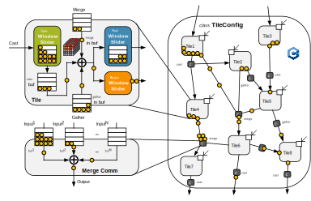

TokSim仿真
=============

什么是 :py:data:`TokSim` 仿真?
----------------------------------

类似于多数 AI 加速器, 在存算一体系统中, 缓存是至关重要的, 因为多个卷积层之间的中间结果需要被缓存, 即使采用反压式的流计算, 卷积窗口的数据依赖关系以及多个分支固有的数据量不平衡会导致在某些计算节点, **数据需要首先被积攒到一定量才能被释放, 如果缓存容量无法满足数据积攒的缓存需求, 则会导致生产-消费死锁**. 

然而, 不同于常规的生产消费者模型中 token 消费和生产的数量和比率是恒定的, **在存算一体系统中, 卷积计算节点每次执行消耗和生产的 token 数量是不固定的, 变化的**, 因此无法采用传统的分析方法对存算一体系统中的各缓存容量需求进行精确评估. 

基于此问题, 我们开发出了 :py:data:`TokSim` 仿真器,  通过逐次迭代模拟Tile之间的生产消费过程, 从而实现对存算一体系统中各缓存容量的精确评估. 

:py:data:`TokSim` 的组织结构
-------------------------------

:py:data:`TokSim` 对设备任务进行生产消费者建模, 如下图所示:

.. raw:: html

     

 在该模型中, 每个 Tile 包含:
 
+ 一个卷积窗口滑动器 (Conv Window Slider) 
+ 一个池化窗口滑动器 (Pool Window Slider) 
+ 一个 Resize (上采样) 窗口滑动器 (Resize Window Slider) 
+ 一个 Merge 接收端缓存 (merge buf) 
+ 一个 Gather 接收端缓存 (gather buf) 
+ 一个中间结果缓存 (inter buf) 

其中, 卷积/池化窗口滑动器用于模拟由于窗口滑动而形成的数据依赖关系和生产-消费过程, 其内部设有一个缓存, 用于存储那些已经到达但由于窗口需求还不能被释放的 token. 多个 Tile 之间通过 cast, merge 和 gather 三种通信元进行连接,  三种通信元分别用于实现三种数据流的通信转发和缓存.  

为了评估每个缓存的最小需求, 每次迭代时, 首层 Tile 均接收一个 token, 且所有Tile 中的每个计算节点均执行至多一次计算. 

.. important::

    + 为了提升迭代速度, 我们使用 C++实现 TokSim 的建模, 相比Python迭代速度提升了100倍.
    + 我们通过 Python 的静态编译库Cython 实现 TokSim 与 |name| 的对接, 既保证了执行速度, 又保证了用户能够方便地从 |name| 中调用 TokSim.

使用 :py:data:`TokSim` 进行缓存容量评估
----------------------------------------

在构建 :py:data:`TokSim` 时, 仅需要传入一个位置参数:

    + :py:data:`CTG`, 可以从 :py:data:`TileMapper.ctg` 属性获取.

下面以一个展示了 :py:data:`TokSim` 的使用方法:

.. code-block:: python

    # 代码接上回
    ...

    # 创建TokSim仿真器
    toksim = TokSim(tm.ctg, **config)

    # 运行TokSim仿真
    toksim.run()

在 :py:data:`TokSim` 仿真运行结束后, 会自动将缓存容量的评估报告打印到终端, 如下 (单位/个数据):

.. code-block:: shell

    tile (0, 0, 0, 0)     gather_buf 0       merge_buf 0       pool_buf 14528     inter_buf 0        conv_buf 4053
    tile (1, 0, 0, 0)     gather_buf 0       merge_buf 0       pool_buf 0         inter_buf 0        conv_buf 7360
    tile (2, 0, 0, 0)     gather_buf 7296    merge_buf 0       pool_buf 0         inter_buf 0        conv_buf 7360
    tile (3, 0, 0, 0)     gather_buf 0       merge_buf 0       pool_buf 0         inter_buf 0        conv_buf 7360
    tile (4, 0, 0, 0)     gather_buf 7296    merge_buf 0       pool_buf 0         inter_buf 0        conv_buf 7360
    tile (5, 0, 0, 0)     gather_buf 0       merge_buf 0       pool_buf 0         inter_buf 0        conv_buf 7360
    tile (6, 0, 0, 0)     gather_buf 0       merge_buf 0       pool_buf 0         inter_buf 0        conv_buf 3712
    tile (7, 0, 0, 0)     gather_buf 3712    merge_buf 0       pool_buf 0         inter_buf 0        conv_buf 7552
    tile (8, 0, 0, 0)     gather_buf 0       merge_buf 0       pool_buf 0         inter_buf 0        conv_buf 7552
    tile (9, 0, 0, 0)     gather_buf 7424    merge_buf 0       pool_buf 0         inter_buf 0        conv_buf 7552
    tile (10, 0, 0, 0)    gather_buf 0       merge_buf 0       pool_buf 0         inter_buf 0        conv_buf 7552
    tile (11, 0, 0, 0)    gather_buf 0       merge_buf 0       pool_buf 0         inter_buf 0        conv_buf 3840

与此同时:

+ 缓存容量表被保存至 `./mapsave/your-mapname/toksim/buffer.csv` 文件中.
+ token迭代信息被保存至 `./mapsave/your-mapname/toksim/tokens.pkl` 文件中.

使用 :py:data:`TokSim` 进行通信负载分布评估
-------------------------------------------

使用 |name| 提供的 :py:data:`plot_tokens` 函数加载刚才保存的tokne迭代信息并作出通信负载分布图:

.. code-block:: python

    plot_tokens(config['mapname'])
